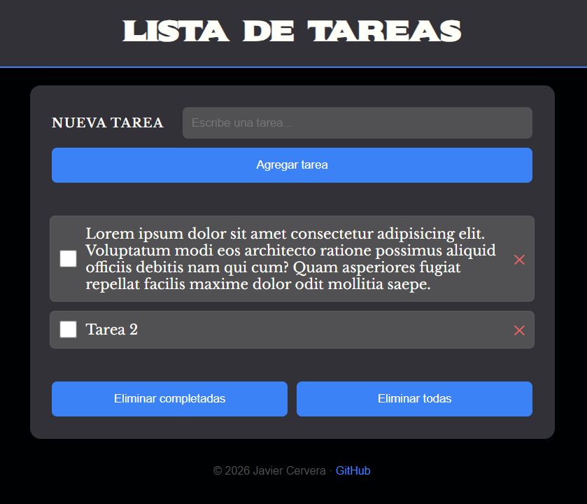

# Lista de Tareas

Aplicación de lista de tareas desarrollada con HTML, CSS y JavaScript Vanilla, enfocada en la manipulación del DOM, gestión de estado y persistencia de datos con localStorage.

---

## Características

- Añadir tareas mediante un formulario
- Marcar tareas como completadas
- Diseño moderno con tema oscuro
- Interfaz limpia y fácil de usar
- Eliminar tareas individuales
- Eliminar tareas completadas
- Eliminar todas las tareas
- Persistencia automática mediante localStorage
- Responsive:
  - 📱 Móvil (vertical y horizontal)
  - 💻 Escritorio

---

## Tecnologías utilizadas

- HTML5
- CSS3 (Flexbox)
- Variables CSS (custom properties)
- JavaScript Vanilla
- LocalStorage API
- Manipulación del DOM

---

## Diseño responsive

La aplicación está adaptada para diferentes tamaños de pantalla:

- En móvil:
  - El formulario se reorganiza en columna
  - Los botones se muestran en vertical

- En escritorio:
  - Layout centrado con ancho máximo
  - Espaciado equilibrado

---

## 🎯 Objetivo del proyecto

Este proyecto forma parte de mi aprendizaje en desarrollo web, con el objetivo de:

- Practicar manipulación del DOM
- Gestionar el estado de la aplicación mediante JavaScript
- Aplicar el patrón Single Source of Truth
- Implementar persistencia de datos con localStorage
- Mejorar la organización y mantenibilidad del código

---

## 📸 Vista previa

---

## 🔗 Demo

[Ver demo](https://jacercen.github.io/todo-list-js/)

---

## 👤 Autor

**Javier Cervera**

- GitHub: [@jacercen](https://github.com/jacercen)

---

## 📌 Notas

Posibles mejoras futuras:

- Edición de tareas
- Filtros (todas / completadas / pendientes)
- Drag & drop
- Animaciones más avanzadas
- Tests y refactorización

---
