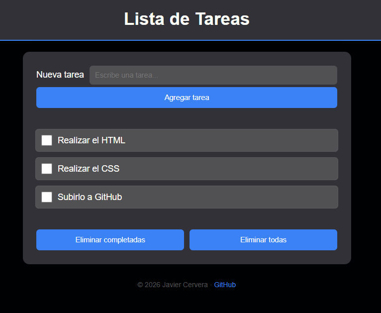

# Lista de Tareas

Aplicación sencilla de lista de tareas desarrollada con **HTML y CSS**, enfocada en la práctica de maquetación, diseño moderno y responsive.

---

## Características

- Añadir tareas mediante un formulario
- Marcar tareas como completadas
- Diseño moderno con tema oscuro
- Interfaz limpia y fácil de usar
- Responsive:
  - 📱 Móvil (vertical y horizontal)
  - 💻 Escritorio

---

## Tecnologías utilizadas

- HTML5
- CSS3 (Flexbox)
- Variables CSS (custom properties)

---

## Diseño responsive

La aplicación está adaptada para diferentes tamaños de pantalla:

- En móvil:
  - El formulario se reorganiza en columna
  - Los botones se muestran en vertical

- En escritorio:
  - Layout centrado con ancho máximo
  - Espaciado equilibrado

---

## 🎯 Objetivo del proyecto

Este proyecto forma parte de mi aprendizaje en desarrollo web, con el objetivo de:

- Practicar estructura HTML semántica
- Mejorar el uso de CSS (Flexbox, variables, responsive)
- Entender la importancia del diseño y la experiencia de usuario (UX)

---

## 📸 Vista previa

---

## 🔗 Demo

https://jacercen.github.io/todo-list/

---

## 👤 Autor

**Javier Cervera**

- GitHub: https://github.com/jacercen

---

## 📌 Notas

Este proyecto es una base que se podrá ampliar en el futuro añadiendo:

- JavaScript para funcionalidad completa
- Persistencia de datos
- Mejoras visuales y animaciones

---
